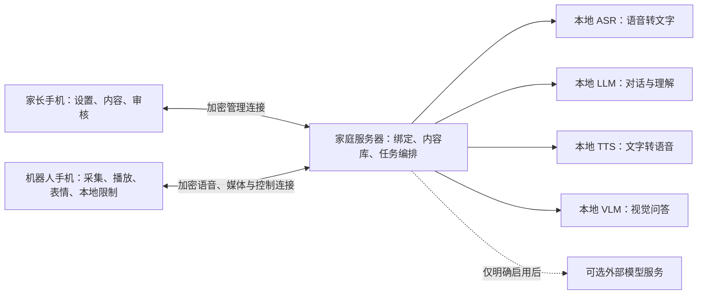

# 内容播放、声音与服务端/App 协作说明

版本：v1.3 设计讨论稿。日期：2026-09-22。适用：一个家庭、一名目前 5 岁的孩子、两部 Android 手机、可常开的家庭电脑。

v1.4 衔接：本轮新增图书需求已直接写入 [PRD 第 9 节](01-产品需求文档.md) 和 [技术方案第 10 节](02-技术方案.md)，维护流程见 [资源库与图书维护指南](11-资源库与图书维护指南-v1.4.md)。本说明的通用内容流程继续适用；图书使用封面定位已发布版本，按审核正文朗读，不能只靠大模型记忆。图书的发布/音频就绪/离线状态以 v1.4 的细化规则为准。

本文说明儿歌和故事从哪里来、哪些功能使用模型、声音如何配置，以及三端如何协作。这里的“端云”包括可选的外部模型服务；家庭服务器本身不是公网云服务。所有流程均为待实现设计，不代表已有 APK、服务器或可用内容库。

## 1 已确认的方向与本文建议

已确认：孩子目前 5 岁，需要随年龄成长适配；主场景是陪聊、趣味互动、故事和英语启蒙，识物为辅；英语零基础，以英语环境和磨耳朵为主；机器人安静为主；家长手机可以配置禁用时段；家庭电脑常开可以接受。同一 APK 分家长/机器人身份、纯表情、语音唤醒、30 秒续问、10 分钟问答上限、相机随授权会话开启，继续保留。

本文建议的首版落地方式：家庭电脑管理内容库并承担完整 ASR、LLM、TTS 和视觉推理的编排；机器人负责实时交互、本地有限命令、播放、表情与限制执行；家长手机负责配置与审核。具体模型、资源数量、音色、每日额度和默认时间表尚未确认。20:00—次日 09:00 是用户举例，不自动当作已经保存的配置。

“已确认”条款补充旧版；其余“建议”“首版推荐”条款是本次评审方案，确认后再纳入统一实现基线。相关产品缺口与决策见 [10-整体产品细节与优先级](10-整体产品细节与优先级-v1.3.md)。

## 2 儿歌和故事一定要下载到电脑吗

技术上不一定；对这个家庭场景，推荐“电脑保存主库、机器人手机下载常用内容”。家长手机也可以上传文件到服务器，不需要每次坐到电脑前操作。首次从电脑导入可以提供受控的导入目录；扫描文件只是生成待审核条目，不等于立即供孩子播放。

| 内容类型 | 如何获得声音 | 是否需要事先存音频 | 是否需要大模型 | 首版安排 |
| --- | --- | --- | --- | --- |
| 已有儿歌、童谣、真人故事录音 | 直接播放原音频 | 推荐电脑保存，再按需下载到机器人 | 播放不需要；模糊点播可辅助理解 | 主路径 |
| 家长提供的故事文字 | TTS 把文字读成音频 | 不必预先有音频；可提前合成 | 不需要 LLM，除非要求改写 | 主路径，合成后试听审核 |
| 临时提问、闲聊回答 | LLM 生成文本，再由 TTS 发声 | 不需要预先存音频 | 通常需要 LLM | 对话主路径 |
| “编一个关于恐龙的故事” | LLM 创作，再由 TTS 发声 | 不需要预先存音频 | 需要 LLM，另需内容检查 | P1 可选，默认故事先来自审核库 |
| “你唱一首新歌” | 专门的歌声/音乐生成能力 | 取决于生成方案 | 普通 LLM 加普通 TTS 不等于歌声合成 | 后置 |
| 在线平台的内容 | 官方允许的播放接口或可导出的资源 | 不一定，可流式播放 | 不需要 LLM | 不作为首版依赖 |

即使采用流式播放，声音也由机器人手机扬声器播放，不是由电脑扬声器播放。电脑可以边读文件边传给机器人，不必先把整套内容复制到手机；但只有完整下载且校验通过的条目才标记“离线可用”。Android Media3 提供媒体下载、状态管理与离线播放机制，可作为实现组件。[官方媒体下载文档](https://developer.android.com/media/media3/exoplayer/downloading-media)

内容来源优先为家长自有且可使用的文件、明确允许使用的资源或自行创作内容。平台会员不等于拥有可导出的音频；首版不做自动抓取付费平台、不把搜索结果 URL 当作稳定音频源。作品文本、具体录音和配乐的来源分别记录。本轮不采购或下载实际内容。

## 3 内容库怎样管理

### 3.1 导入到播放的流程

家长选文件/文本 → 上传到家庭服务器 → 校验格式、时长、文件大小和可解码性 → 填写年龄/语言/主题 → 家长试听审核 → 上架 → 选择是否下载到机器人 → 机器人回报下载完成。

建议首版支持经过实机验证的 MP3、M4A、WAV 输入，服务器按统一策略生成手机播放版本；支持扩展名不等于所有编码都可直接解码。损坏、超限或不支持的文件明确报错。内容库初次为空时，引导家长导入或安装有明确来源的起步包；不能承诺安装 App 就自带商业曲库。

每条内容至少记录：contentId、版本、标题、口语别名、语言、年龄段、英语难度、主题、类型、时长、来源/使用说明、审核状态、文件校验值。文字故事额外记录原文版本和合成参数；本机下载状态和播放进度按机器人分别记录。

首版内容规模建议小而精，例如先准备十余首儿歌/童谣、十余个中文故事和少量英语短对话，由家长挑选；此数量是建议，不是已取得的资源。

### 3.2 点播与选择

- “放小星星”：先按标题和别名检索已审核库，结果唯一直接选中，重名时最多给两个口头选项。
- “听英文儿歌”：按语言、难度、剩余时间、收藏和最近播放筛选；英语磨耳朵允许有意重复，不强制每次换新。
- “讲个恐龙故事”：先查审核库；没有时说明并提供现有替代，不编造“已找到”。未来开启原创故事后，才可询问是否现场创作。
- LLM 只能在候选 contentId 中帮助选取。实际播放前由程序校验条目存在、已审核、可访问、时间允许，禁止执行模型随意生成的地址或文件路径。

### 3.3 下载、存储与删除

电脑为主库，机器人只保存已审核目录与所需音频。家长可固定常听内容为离线收藏；临时播放缓存可以按空间清理，固定收藏不得无提示自动清掉。下载中断保留可恢复状态，校验失败重新下载，空间不足明确提示。

缓存键包含内容版本；合成音频还包含文本版本、TTS 模型版本、音色、语言和语速，避免换声音后误播旧文件。下载、文字转语音预生成等后台工作应让位于正在进行的对话。

删除/下架先禁止新播放，再通知在线机器人停播并清除该版本；离线设备显示“待同步删除”，不能宣称已经全端清除。重连先同步目录与撤销信息，再处理新点播。首版沿用离线时最后一次有效审核目录，家长端明确说明：新删除命令无法立即触达离线手机，可通过机器人本地 PIN 管理删除。未来如要求撤回必须即时生效，需牺牲离线播放或增加授权有效期，不能同时承诺两者。

## 4 哪些由大模型处理

| 能力 | 首版建议负责者 | 说明 |
| --- | --- | --- |
| 叫昵称、检测是否在讲话、播放中停止 | 手机本地 KWS/VAD/有限命令识别 | 不等待电脑或互联网；与播放共用受控音频路径 |
| 将完整用户语音转文字 | 家庭服务器上的 ASR | 专用语音识别模型；不等于聊天大模型 |
| 选择聊天还是播放、解析模糊请求 | 确定规则优先，LLM 辅助 | 明确停止命令不经过 LLM；结构化结果仍需程序校验 |
| 回答问题、闲聊、解释词义、可选原创故事 | 文本 LLM | 输入当前上下文、年龄策略及允许使用的记忆 |
| 看物体并解释 | 视觉模型/VLM | 仅在视觉提问时处理必要新帧 |
| 将回答或故事文字变成声音 | TTS | 与 LLM 解耦，决定音色及合成语音参数 |
| 播放现成音频、暂停、续播、音量 | 手机播放器 | 不需要大模型 |
| 表情和嘴形 | 手机表情引擎 | 状态及实际播放音频驱动；模型只可建议有限情绪标签 |
| 禁用时段、每日额度、权限、绑定 | 确定性程序 | LLM 不得修改或绕过 |
| 长期记忆 | 服务端提出候选，家长审核后保存 | 模型不能自行把任何聊天内容永久记住 |

完整 ASR 放电脑是为减轻旧手机负担的建议默认，并非唯一技术路线。手机仍需独立具备有限离线命令；未来只有实测证明手机完整 ASR 更合适时才改变部署。TTS 也可在手机部署，但首版推荐电脑提供日常合成，手机内置提示音及已下载媒体作为降级能力。

## 5 对话声音可以配置吗

应当支持，由家长端配置。LLM 负责“说什么”，TTS 负责“用什么声音说”；不必为了换音色更换聊天模型。

| 配置项 | 建议行为 |
| --- | --- |
| 中文对话声音 | 从实际安装、许可明确、试听合格的音色中选，不填任意角色名字就承诺合成 |
| 英文声音 | 单独选英文音色/口音；中英文可以属于同一多语音色，也可以映射到两个声音 |
| 故事朗读声音 | 可沿用对话声，也可独立选择；只影响 TTS 合成故事 |
| 语速 | 仅展示当前引擎验证支持的范围；英语初值经试听确定，不任意极慢拉伸 |
| 音量与上限 | 手机播放器最终执行上限；不能仅靠模型“说小声点” |
| 试听与应用 | 家长手机试听短中文和英文样句，通过后提交；收到机器人应用结果才标记生效 |

**现成儿歌和真人故事保留原录音声音。** 换机器人音色不会把录音中的歌手或讲述者替换掉；那属于另外的声音转换能力，不纳入首版。首版也不做真人声音克隆。

首版优先本地 TTS，可研究既有 sherpa-onnx 候选；其文档提供 TTS 模型与使用入口，具体音色、语言、运行设备和许可必须按选定模型验证。[sherpa-onnx TTS 官方文档](https://k2-fsa.github.io/sherpa/onnx/tts/index.html)

Android 系统 TTS 提供声音、语速等接口，但具体支持由已安装引擎及声音决定；不能据接口存在就保证某机型具备离线中英双语声音。本方案不把系统 TTS 当作未经验证的万能兜底。[Android TextToSpeech API](https://developer.android.com/reference/android/speech/tts/TextToSpeech)

音色变更在当前回答结束后应用；预生成故事生成新版本且可试听，正在播放的故事不半途换声。合成失败时先使用同一已审核备用音色（若家长已选择），否则播放本地简短故障提示。不得静默调用云端 TTS，因为待合成文字可能包含孩子的信息。

## 6 三端分工与连接图

此图是推荐部署，不表示家庭电脑已经能流畅同时运行全部模型。先用实际设备测算；本地对话质量或延迟不达标时，另行选择更轻模型、硬件调整，或明确开启仅文本云端对话。接受本地服务器不等于同意任何云端数据上传。

| 端 | 必须负责 | 不负责 |
| --- | --- | --- |
| 机器人手机 | 唯一录音入口、AEC、唤醒与停止、会话计时、相机生命周期、媒体播放、嘴形、下载、本地时间限制、实际状态回报 | 内容创作后台任务、默认持久保存原始录音和画面 |
| 家庭服务器 | 服务身份、设备绑定、ASR/LLM/TTS/VLM 编排、内容目录和文件、配置版本、审核记忆、用量和诊断 | 直接假定手机已播放/已停止，绕过手机权限，代替本地紧急停止 |
| 家长手机 | 扫码绑定、孩子档案、时段与额度、声音试听、内容导入审核、下载管理、设备状态、记忆管理 | 常驻唤醒、环境录音、默认实时查看机器人摄像头 |

服务器保存期望配置和版本，机器人保存已生效配置、实际播放状态和实时计时；家长端展示二者差异。模型只能提出内容或受限动作建议，实际执行权在经过校验的程序与手机端。

## 7 四条完整协作流程

### 7.1 日常聊天

1. 手机检查是否允许使用；允许时本地检测昵称并响应，按家长摄像头策略开启相机。
2. 手机处理回声与断句，只把当前会话的必要语音发给受信任的家庭服务器。待机环境音不发送。
3. 服务端 ASR 转文字，明确指令先走规则；聊天则组织年龄策略、会话上下文、已审核且允许用于当前模型的记忆后调用 LLM。
4. 回答经过儿童内容处理，再送 TTS。首版建议按完整短句检查后分段合成；尚未检查的生成内容不直接播出，避免先播出再拒绝。
5. 服务器返回音频块、序号、所属轮次和有限表情标签。手机再次检查时段、会话有效性后按序播放，嘴形由实际播放驱动。
6. 播放真正结束后启动 30 秒续问；停止或到点会立即清理本地队列，并取消远端任务。迟到结果丢弃。

内容检查不承诺绝对正确：首版需用儿童场景用例评估，并提供“不确定、请找家长”的路径。未开放联网检索时，不回答为已经核实的实时天气、新闻等。

### 7.2 点播儿歌或故事

1. 识别“放一首英文儿歌”，程序提取语言和类型，查询已审核目录；必要时 LLM 从候选条目中选择。
2. 服务器返回 contentId、版本、时长和受鉴权保护的媒体位置；手机验证时间及内容状态。
3. 已完整下载则直接播放；否则从家庭服务器取音频，可边传边播。网络请求不经过公网内容平台。
4. 手机记录进度，执行“暂停、继续、换一个、从头开始”。允许联网时回报状态，离线时在本机继续计时。
5. 长媒体不会延长相机保活：最后一次有效用户输入 30 秒后关闭相机。问答上限为 10 分钟，媒体另外受播放时限、每日额度与禁用时段限制。

服务器离线时，手机不具备完整自然语言理解的承诺；应内置“播放离线儿歌/故事、继续、暂停、下一首、停止”等有限命令及本机已审核目录。仅把文件下载到手机，却没有离线点播入口，不算离线可用。未在目标机验收的离线命令不能写成已支持。

### 7.3 文字故事变成可播放故事

家长导入文字 → 服务端保存文本版本 → 使用所选本地 TTS 生成音频 → 家长试听、审核 → 上架并可下载。无需每次播放重新调用 LLM 或 TTS。更改文字或声音后生成新音频版本，旧审核不自动覆盖新版本。

原创故事属于另一条可选流程：孩子提出主题 → LLM 生成与检查 → TTS 朗读。若要加入长期内容库，必须经过家长审核；当次生成不会自动成为永久收藏。首版优先完成固定库，原创故事留到 P1。

### 7.4 家长修改禁用时段

家长提交规则及 expectedConfigVersion → 服务端验证权限并转交 → 手机原子保存并立即重新判断当前是否允许使用 → 手机返回 appliedConfigVersion → 家长端显示已生效。

如果当前时间已落入新的禁用区间，立即停止媒体与对话、释放麦克风和相机。离线时不显示成功，也不在恢复连接后偷偷重放旧控制命令；用户刷新后重新提交。已经生效的规则无需服务器在线便可继续执行。

## 8 播放、对话与限制的冲突如何处理

| 场景/口令 | 建议确定行为 |
| --- | --- |
| 播放中叫昵称 | 暂停媒体并保存位置，进入新一轮提问；不在回答结束后擅自续播 |
| “暂停/停一下” | 媒体暂停并保留位置；正在生成的对话回答则取消，不能把回答当成可续播故事 |
| “继续” | 有有效暂停媒体且仍允许使用则续播；没有时澄清，不回放取消的回答 |
| “休息吧/再见” | 结束当前会话与播放、关相机；故事进度可保存，下一次需明确要求继续 |
| 双击脸 | 立即停止播放和生成；不恢复旧回答，媒体进度可供后续主动续播 |
| 问题插入故事 | 暂停故事；没有对应故事文本时，不假装知道音频中刚讲了什么 |
| 30 秒无输入 | 结束问答等待；长媒体允许继续，但相机必须按媒体规则关闭 |
| 10 分钟问答到期 | 结束问答与相机；不允许借媒体重新开启无限问答 |
| 禁用时间/额度到达 | 立即结束所有儿童交互和媒体；长媒体、下载内容、换音色均无豁免 |
| 来电、失去音频焦点、App 后台或锁屏 | 首版建议暂停媒体、结束采集，不自动恢复；不承诺锁屏语音停止或自动解锁 |
| 重启或网络恢复 | 恢复配置与进度供用户选择，不自动播放 |

已确认的会话计时保持原值；媒体暂停语义与后台停播是本次细化建议。建议将使用许可状态单独建模为 Allowed / ScheduledBlocked / QuotaBlocked / ManualBlocked，与 SessionState、播放器状态分离，避免“休息待机仍能唤醒”误绕过禁用时段。

## 9 时间控制怎样真正生效

禁用区间采用家庭时区，支持跨午夜与按星期配置，示例区间为 [20:00, 次日09:00)，即 20:00 已禁用、09:00 起允许。首版设置时家长确认实际时间表；未配置完成前不把设备交给孩子自行使用。

建议每日额度按机器人实际参与对话或播放的时间累计：收听有效语音、识别/推理等待、回答、故事、儿歌、游戏算使用；纯待机与仅等待续问不算，重叠活动不重复计算。所有英语播放也算，不能以“磨耳朵”名义绕过。每日额度是否启用、具体分钟数待家长确认。

累计时长以单调时钟计算并定期持久化，按家庭日历日归档，重启不能清零；异常退出存在的小量记账误差需要测试并给出界限。与服务端同步用带序号的事件去重，不能重复累加或以旧服务器值覆盖较新的本机用量。

禁用期完全释放麦克风和相机，触摸只允许进入需要 PIN 的管理入口；不能用普通触摸恢复唤醒。09:00 到时仅在 App 正常运行且系统允许时恢复可用，不主动播报，不承诺手机被锁屏/杀进程后自动进入陪伴模式。需要物理重新打开 App 时，应在家长设置中说明。

改时钟/时区、倒拨时间和设备重启纳入检查；发现无法可信判断当前时间时暂停儿童功能，等待连接可信服务校时或家长验证。普通 App 无法阻止设备所有者改系统、卸载或清数据，不能宣称不可绕过；重装后需重新通过家长设置。临时放行必须经家长认证、限定期限，不能由孩子语音获取。

## 10 首次连接是否需要域名

需要一个可到达且身份可信的服务地址，不需要购买公网域名。可使用路由器保留的局域网 IP 加端口，或家庭网络可解析的主机名。推荐 DHCP 地址保留，降低电脑重启后换地址的概率；同一 Wi-Fi 也可能因访客网络隔离或防火墙而无法互通。

推荐流程：

1. 电脑运行服务，完成首次管理员初始化，展示服务连接二维码；不设置公开默认密码。
2. 机器人选择身份、设置 PIN，扫描家长亲自在电脑屏幕上展示的二维码，取得地址、服务身份校验材料及短时注册材料，完成注册。服务连接码与家长配对码是两种用途。
3. 机器人展示短时家长配对码；家长手机选择身份后扫描，获得服务地址并核对机器人信息，再由机器人本地确认绑定。
4. 保存地址和独立凭证，以后自动连接。手动输入地址仍需通过可信渠道核对服务身份，不跳过证书检查。

局域网 HTTPS 可用受信任证书或应用受控信任机制；IP/主机名与证书身份、二维码指纹验证需要一起设计。不能采用“信任任意证书”。地址变更但服务身份不变可以在验证后更新；服务身份变化必须重新确认，服务器证书轮换需有更新流程。

第一版不用 UPnP、路由器端口映射或公网远程入口。两台手机在家庭网络内访问，家长离家默认不可管理。电脑休眠、系统防火墙、服务自启动与重启恢复属于部署步骤，应提供检查结果。

## 11 数据去向、离线能力和服务优先级

### 11.1 数据和权限

手机到电脑的语音及必要图像只在当前任务短时处理，默认不落盘、不进入诊断日志；推理组件自身的请求日志和临时文件也须检查。普通会话文字默认只保留会话期间；长期记忆只保存家长审核条目与最小必要来源摘录。

可选文本云端对话只发送经过出站策略允许的文字；它不自动获得音频、画面或全部记忆。云端 ASR、视觉、TTS 分别授权、分别说明数据类型，默认关闭；故障不触发自动上云。API 密钥由服务端保管，不下发给孩子端。

家长端能看状态、配置、内容和必要诊断，默认不能实时监听或监看孩子。诊断模式需显式开启且有期限，导出需脱敏；不得以调试为由默认保存完整聊天。

### 11.2 推荐降级矩阵

| 能力 | 家庭服务在线、互联网断开 | 家庭服务离线、手机 App 在前台 |
| --- | --- | --- |
| 本地唤醒、有限停止命令、表情、时段限制 | 可用，须完成机型验证 | 可用，禁用期除外 |
| 已完整下载且未撤销的媒体 | 可用 | 可用，限本机目录和有限点播命令 |
| 电脑主库中未下载媒体 | 可取用 | 不可用，已缓冲部分不等于完整离线内容 |
| 完整聊天 | 已部署本地 LLM/ASR/TTS 才可用 | 首版不承诺，播放本地故障提示 |
| 新文字故事合成/视觉问答 | 已部署相应本地模型才可用 | 首版不承诺 |
| 家长端修改配置 | 两端到服务的局域网连接正常即可 | 不可用；机器人本地 PIN 管理可用 |
| 以前生效的规则 | 继续执行 | 继续执行 |

这替代旧文档中“服务器断连仍继续普通语音”的模糊说法：普通语音必须区分完整聊天与有限离线命令。

### 11.3 服务器资源

一个家庭先服务一台机器人，优先保证当前交互。控制与取消通道不被推理占用；ASR、实时回答和 TTS 优先于后台内容合成，视觉按需调用；低内存时暂停后台任务，不同时加载所有大模型导致整机不可用。

请求设置超时、有限重试和队列上限；建议沿用既有 PRD 延迟目标实测，慢时只作一次本地提示，失败后恢复可操作状态。重试不得重复播放或重新启动已取消任务。服务器停止后机器人本地立即取消仍不依赖远端响应。

## 12 供开发拆分的最小契约

本节是接口职责草案，不是已发布 API；具体路径和传输格式在实现前冻结。

| 对象/消息 | 最小信息 | 必须检查 |
| --- | --- | --- |
| 服务能力 | protocolVersion、服务身份、可用模型/音色、健康状态 | 不兼容时阻止相关功能，不能崩溃循环 |
| 对话任务 | robotId、sessionId、turnId、generationId、配置版本 | 身份与权限有效、输入大小受限、取消后拒收旧结果 |
| 音频块/结束 | 所属任务、序号、编码/采样参数、结束/错误标记 | 按序去重、有界缓冲；未结束不假定播放完成 |
| 媒体播放 | contentId、内容版本、playbackId、起始位置 | 存在、已审核、权限/时间允许；无任意 URL 执行 |
| 配置修改 | requestId、expectedConfigVersion、变更字段 | 冲突拒绝；区分 accepted 与 applied |
| 限制状态 | 规则版本、家庭时区、累计用量、实际阻止原因 | App 本地判定优先，不让模型覆盖 |
| 取消/停止 | commandId、目标任务/播放标识 | 手机先停，再通知；重复请求无副作用，不重放为继续 |
| 设备心跳 | 更新时间、服务/模型/下载状态、权限、实际配置版本 | 过期状态标记失联，不能只看服务器在线就显示机器人在线 |

所有媒体、上传、配对、管理接口都校验设备权限；服务端限制上传大小、文件路径和内容类型，LLM 无文件系统和任意网络控制权限。普通模型回答、故事文字、图片中的文字均不能成为管理指令。

## 13 官方资料与验证边界

2026-09-22 核对了上文链接的 Android Media3 下载、Android TTS 与 sherpa-onnx TTS 官方文档。它们证明可复用的基础接口或组件存在，不证明已经满足本项目的中文儿童识别、中英音质、低延迟或离线承诺。

本轮只完成文档方案；没有运行模型、导入儿歌、构建 APK、测试时间封锁或试听音色。实际验收项目和未决问题见 [10-整体产品细节与优先级](10-整体产品细节与优先级-v1.3.md)。
